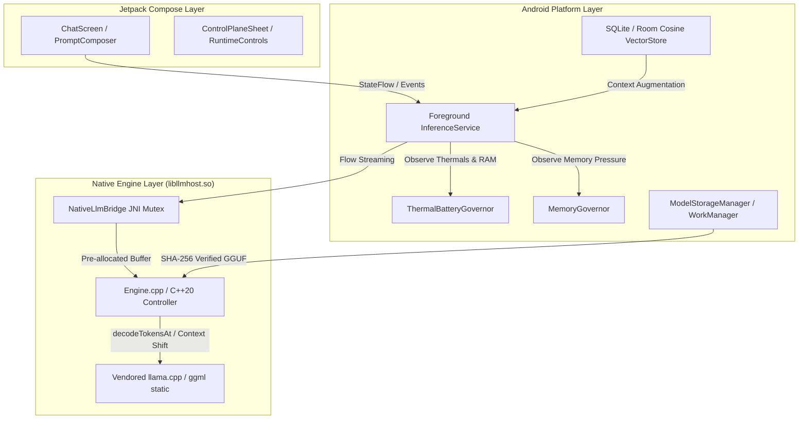

# Prism Local — On-Device Android AI & Local LLM Host

[](LICENSE)
[](https://kotlinlang.org)
[](https://developer.android.com/jetpack/compose)
[](https://isocpp.org)
[](https://developer.android.com/ndk)
[](https://developer.android.com/guide/practices/page-sizes)
[](https://github.com/gthgomez/PrismLocal/actions/workflows/android-ci.yml)

Prism Local is an open-source Android application for high-performance, private, on-device GGUF large language model (LLM) inference. It embeds a C++20 `llama.cpp` runtime into an Android foreground service via a thread-safe JNI bridge, providing local inference without requiring a cloud LLM provider, alongside chat, tool dispatch, document retrieval (RAG), and model lifecycle management.

---

## Architecture Overview



---

## Key Technical Systems

1. **Thread-Safe JNI & Native LLM Engine**:
   - Thread-safe JNI bridge embedding a vendored C++20 `llama.cpp` runtime.
   - Streams generated tokens via a pre-allocated carrier buffer as `Flow<GenerationChunk>` to keep token streaming off the UI thread and reduce allocation pressure.
   - Intra-batch C++ cancellation checks in `decodeTokensAt` enable responsive user interrupts.

2. **Platform & Hardware Lifecycle Governors**:
   - `ThermalBatteryGovernor` monitors Android thermal status and battery level, auto-pausing active inference when device thermals reach `SEVERE+` or battery drops below `15%`.
   - `MemoryGovernor` polls system memory pressure (`ComponentCallbacks2`) and throttles native allocations to mitigate OOM risk.

3. **Fail-Closed Production Signing Infrastructure**:
   - Custom Gradle build convention plugin (`AndroidProductionSigningPlugin`) executing pre-build PKCS12 keystore verification, pinned certificate SHA-256 fingerprint checks, and validity window validation.

4. **16 KB Page-Size Hardening & Multi-Variant Release CI**:
   - Linker-enforced 16 KB page-size flags (`-Wl,-z,max-page-size=16384`) and verified ELF `PT_LOAD` 16 KB segment alignment for Android 15/16 compatibility.
   - Pinned NDK r28+ and CMake 3.22.1 toolchain.
   - GitHub Actions CI running unit tests (`testDevDebugUnitTest`, `testPlayDebugUnitTest`) and unsigned minified release builds (`assembleDevBenchmark`, `assemblePlayRelease`).

5. **Local Storage & Offline Vector Store**:
   - Resumable, SHA-256 verified Hugging Face GGUF model downloads managed via Android `WorkManager`.
   - Local SQLite/Room conversation persistence and offline document chunking with cosine similarity vector indexing.

---

## Security & Privacy Model

- **Local Inference First**: Model execution and conversation storage remain strictly on-device by default.
- **No Analytics SDK**: Zero advertising trackers or automated background telemetry collectors are included.
- **Explicit Network Boundaries**: Outbound network requests occur strictly on user/agent-initiated actions (Hugging Face model downloads, web search, Grokipedia queries) and are documented in [PRIVACY.md](PRIVACY.md).
- **Keystore Security**: Cloud API tokens are encrypted via AndroidKeyStore AES-256-GCM.

---

## Getting Started & Building

### Prerequisites

- **JDK:** OpenJDK 17
- **Android SDK:** Compile SDK 36, Min SDK 26, Target SDK 36
- **Android NDK:** `28.2.13676358`
- **CMake:** `3.22.1`

### Clone with Submodules

```bash
git clone --recurse-submodules https://github.com/gthgomez/PrismLocal.git
cd PrismLocal
```

### Build & Test Commands

```powershell
# Run unit test suites (dev & play debug)
.\gradlew.bat --no-daemon :app:testDevDebugUnitTest :app:testPlayDebugUnitTest

# Assemble debug APK
.\gradlew.bat --no-daemon :app:assembleDevDebug

# Full release verification gate (unit tests + DevBenchmark + PlayRelease)
.\scripts\verify.ps1
```

---

## Distribution Status

- **Google Play Status:** Preparing for Google Play distribution (Account verification in progress).
- **Package ID:** `com.prismai.llmhost`

---

## License & Attribution

- **PrismLocal Source:** Licensed under the [Apache License, Version 2.0](LICENSE).
- **NOTICE:** [NOTICE](NOTICE)
- **Third-Party Notices:** Upstream third-party components (including `llama.cpp` under MIT) and notices are cataloged in [THIRD_PARTY_NOTICES.md](THIRD_PARTY_NOTICES.md).
